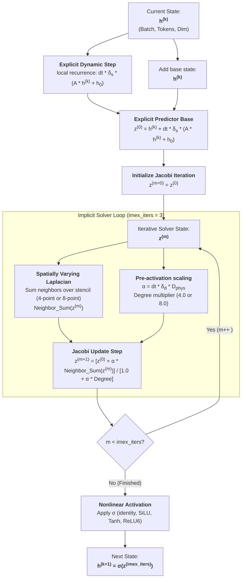

# Continuous Spatial Mamba (CS-Mamba V1.2) IMEX Discretization Architecture

This document presents the detailed architectural diagram and mathematical/algorithmic formulation of the **Implicit-Explicit (IMEX)** discretization scheme implemented in the **CG-Mamba (CS-Mamba V1.2)** architecture.

---

## Visual Architectural Diagram

### 1. Complete Full-Network Architecture
This diagram illustrates the macroscopic workflow of the Continuous Spatial Mamba (CS-Mamba V1.2) Vision model, alongside the micro-architecture of individual CS-Mamba blocks containing the continuous spatial ODE integrator.


### 2. CS-Mamba Block Micro-Architecture
This diagram isolates the internal architecture of a single CS-Mamba block, showing the parallel branching, the gating mechanism, and the residual connections perfectly formatted for publication.


### 3. Continuous Spatial Integrator (IMEX) Mathematical Module
This diagram isolates the continuous mathematical integration loop transitioning the state from $h^{(k)}$ to $h^{(k+1)}$, showing the generation of the Explicit Predictor Base $z^{(0)}$ and the cyclic Jacobi Iterative Solver solving the implicit spatial relations.


---

## 1. Architectural Overview & Discretization Flow

The CSMamba V1.2 continuous ODE formulation models spatial-temporal propagation using:
$$\frac{dh}{dt} = \delta_s (A h + h_0) + \delta_d D_{phys} L(h)$$

Under **IMEX Discretization**, we treat:
- The **local dynamics** ($\delta_s (A h + h_0)$) **explicitly** (low stiffness, inexpensive).
- The **spatial diffusion dynamics** ($\delta_d D_{phys} L(h)$) **implicitly** (highly stiff, requires numerical stability at larger step sizes).

The resulting step integration flow is visualized below:



---

## 2. Mathematical Discretization Derivation

By applying an implicit discretization on the spatial term and explicit on the recurrence term, we obtain the temporal step update:
$$h^{(k+1)} = h^{(k)} + \Delta t \cdot \left[ \delta_s (A h^{(k)} + h_0) + \delta_d D_{phys} L(h^{(k+1)}) \right]$$

Rearranging all terms at time step $(k+1)$ to the left-hand side:
$$\left( I - \Delta t \cdot \delta_d D_{phys} L \right) h^{(k+1)} = h^{(k)} + \Delta t \cdot \delta_s (A h^{(k)} + h_0)$$

Let $z^{(0)}$ be the **Explicit Predictor Base**:
$$z^{(0)} = h^{(k)} + \Delta t \cdot \delta_s (A h^{(k)} + h_0)$$

Let $\alpha$ be the **spatially-varying diffusion step coefficient**:
$$\alpha = \Delta t \cdot \delta_d D_{phys}$$

The system simplifies to a linear system of equations:
$$\left( I - \alpha L \right) h^{(k+1)} = z^{(0)}$$

### Iterative Jacobi Solution
To bypass the extremely expensive $O(N^3)$ computational complexity of inverting a full spatial matrix per token on every step, we utilize a localized, highly parallelizable **Jacobi Iterative Solver** running for a fixed number of steps ($m \in [0, \text{imex\_iters}-1]$):
$$z^{(m+1)} = \frac{z^{(0)} + \alpha \cdot \text{Neighbor\_Sum}(z^{(m)})}{1 + \alpha \cdot \text{Degree}}$$

Where:
- $\text{Neighbor\_Sum}(z)_i = \sum_{j \in \mathcal{N}(i)} z_j$ (computed via 4-point or 8-point spatial grid stencils).
- $\text{Degree}$ is the node degree (4.0 for standard 4-point stencil, 8.0 for 8-point stencil).

---

## 3. Triton Hardware-Level Kernel Optimization

The entire IMEX forward and backward sweeps are completely implemented in **fused Triton JIT GPU kernels** to maximize SRAM localization and avoid expensive DRAM reads/writes:

### Forward Loop Execution
1. A single CUDA thread block maps to a 2D tile of tokens and embedding dimensions.
2. The predictor base $z^{(0)}$ is computed element-wise and stored completely in GPU registers.
3. Over the $m$ iterations of the Jacobi loop, adjacent thread blocks load neighboring token states into local SRAM, evaluate $\text{Neighbor\_Sum}$, and apply the diagonal division step.
4. The final state is activation-scaled $\sigma(z^{(m)})$ and saved back to global HBM.

### Backward Sweeps (Implicit Adjoint Propagation)
The backward pass is computed by reversing the Jacobi iteration directly inside Triton, solving for the adjoint variables using split element-wise and spatial-propagation kernels to yield a **5.7x training speedup** compared to PyTorch autograd:
$$\text{Adjoint\_L}(gp)_m = D_{phys} \cdot L(gp \cdot \delta_d)_m$$
which maps directly to registers:
```python
lap_r = dphys * (r_sum - degree * (dd * gp))
```
